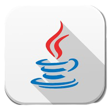
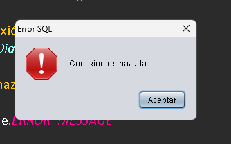

# QuizzMaster 

<h3>
    <a href="https://jeff-aporta.github.io/QuizzMaster2FabianaGameer/">
        https://jeff-aporta.github.io/QuizzMaster2FabianaGameer/
    </a>
</h3>

    

QuizzMaster es una aplicación de cuestionarios construida con Java. Proporciona una plataforma interactiva para crear y realizar cuestionarios.

## Estructura del Proyecto

El proyecto está estructurado de la siguiente manera:

- `src/`: Contiene el código fuente
  - `Tools/`: Clases de utilidad
  - `math/`: Clases relacionadas con matemáticas
  - `quizzmaster/`: Código principal de la aplicación
    - `front/`: Código de interfaz gráfica
  - `sounds/`: Clases relacionadas con audio
- `lib/`: Bibliotecas externas
- `build.js`: Script de construcción para NodeJS
- `index.html`: Punto de entrada para Github Pages

## Dependencias

- gson-java-json.jar
- mysql-connector-j-8.0.31.jar

## Configuración

1. Clona el repositorio
2. Asegúrate de tener Java para ejecutar
 

## Desarrollo

Este proyecto utiliza el IDE NetBeans. Para abrir el proyecto en NetBeans:

1. Abre NetBeans
2. Ve a Archivo > Abrir Proyecto
3. Navega hasta el directorio del proyecto y selecciónalo

## Características

- Creación y gestión de cuestionarios y usuarios
- Interfaz interactiva para realizar cuestionarios

---

## Posibles errores

### Cuando No se puede conectar a MySQL

Por error en credenciales o porque localmente no se ha iniciado MySQL en Xampp (o localmente)

    

